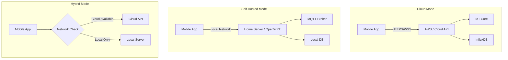

# Janela do Desassossego - Mobile App

> **Smart Living Platform** - AI-powered companion for IoT devices, conservation, and home automation

[]()
[]()
[]()
[]()
[]()

---

## Table of Contents

1. [Product Vision](#1-product-vision)
2. [System Architecture](#2-system-architecture)
3. [Features & Epics](#3-features--epics)
4. [Technical Stack](#4-technical-stack)
5. [Data Models](#5-data-models)
6. [API Specifications](#6-api-specifications)
7. [Testing Strategy](#7-testing-strategy)
8. [Security Requirements](#8-security-requirements)
9. [Roadmap](#9-roadmap)

---

## 1. Product Vision

### 1.1 Mission Statement

> Empower families to live more sustainably by combining IoT sensors, mobile AI, and smart automation into a unified platform that learns and adapts to improve everyday life.

### 1.2 Core Capabilities

| Capability | Description |
|------------|-------------|
| **Conservation Monitoring** | Water usage tracking via acoustic IoT sensors |
| **ML Training with Camera** | Capture photos (plants, resources) to train conservation ML models |
| **Sensor Fusion** | Combine phone sensors + IoT device data for smarter insights |
| **Home Automation** | Control and monitor home devices via local or cloud infrastructure |
| **Self-Hosted Option** | Full offline operation via home server, Raspberry Pi, or OpenWRT router |

### 1.3 Target Users

| Persona | Use Case | Priority |
|---------|----------|----------|
| **Private Families** | Monitor resources, train ML models, home automation | P0 |
| **Hotel Managers** | Water conservation fleet management | P0 |
| **Power Users** | Self-hosted infrastructure, advanced automations | P1 |
| **Developers** | API integration, custom ML model training | P2 |

### 1.4 Deployment Modes



---

## 2. System Architecture

### 2.1 Integration Points

| Component | Technology | Purpose |
|-----------|------------|---------|
| **ESP32 Devices** | ESP-IDF + ML | Acoustic sensing, flow detection |
| **Cloud Backend** | AWS (→ Terraform/K8s future) | Scalable cloud processing |
| **Self-Hosted** | Docker + OpenWRT | Local-first privacy option |
| **Mobile App** | Flutter + Dart | Cross-platform UI + ML inference |

### 2.2 High-Level Architecture

```
┌─────────────────────────────────────────────────────────────┐
│                      PRESENTATION LAYER                      │
│  ┌───────────┐  ┌────────────┐  ┌───────────┐  ┌──────────┐ │
│  │  Screens  │  │ Widgets    │  │ Routing   │  │ Themes   │ │
│  └───────────┘  └────────────┘  └───────────┘  └──────────┘ │
├─────────────────────────────────────────────────────────────┤
│                      BUSINESS LOGIC LAYER                    │
│  ┌───────────┐  ┌────────────┐  ┌───────────┐  ┌──────────┐ │
│  │   BLoC    │  │ Repositories│ │  UseCases │  │ ML Engine│ │
│  └───────────┘  └────────────┘  └───────────┘  └──────────┘ │
├─────────────────────────────────────────────────────────────┤
│                      DATA LAYER                              │
│  ┌───────────┐  ┌────────────┐  ┌───────────┐  ┌──────────┐ │
│  │ REST/GQL  │  │ WebSocket  │  │  SQLite   │  │  Camera  │ │
│  │  Client   │  │  Client    │  │  (Drift)  │  │  + ML    │ │
│  └───────────┘  └────────────┘  └───────────┘  └──────────┘ │
└─────────────────────────────────────────────────────────────┘
```

### 2.3 Project Structure

```
janela-do-desassossego/
├── lib/
│   ├── main.dart
│   ├── app.dart
│   │
│   ├── core/                   # Core utilities
│   │   ├── config/             # App configuration
│   │   ├── error/              # Error handling
│   │   ├── network/            # HTTP/WebSocket clients
│   │   └── theme/              # Design system
│   │
│   ├── data/                   # Data layer
│   │   ├── datasources/        # Remote & local data sources
│   │   ├── models/             # DTOs
│   │   └── repositories/       # Repository implementations
│   │
│   ├── domain/                 # Business logic
│   │   ├── entities/           # Core entities
│   │   ├── repositories/       # Abstract repositories
│   │   └── usecases/           # Business use cases
│   │
│   ├── features/               # Feature modules
│   │   ├── auth/
│   │   ├── dashboard/
│   │   ├── devices/
│   │   ├── camera_ml/          # Photo capture + ML training
│   │   ├── automation/         # Home automation
│   │   └── settings/
│   │
│   └── ml/                     # On-device ML
│       ├── models/             # TFLite models
│       └── inference/          # Inference engine
│
├── test/                       # Unit tests
│   ├── unit/
│   ├── widget/
│   └── integration/
│
├── integration_test/           # E2E tests
├── android/
├── ios/
├── linux/                      # Linux desktop support
├── .github/workflows/
├── pubspec.yaml
└── README.md
```

---

## 3. Features & Epics

### 3.1 Epic 1: Authentication (P0)

| Story ID | User Story | Points |
|----------|------------|--------|
| AUTH-001 | Login with email/password | 3 |
| AUTH-002 | Biometric login (fingerprint) | 3 |
| AUTH-003 | Offline authentication (self-hosted) | 5 |
| AUTH-004 | Role-based access control | 5 |

### 3.2 Epic 2: Dashboard (P0)

| Story ID | User Story | Points |
|----------|------------|--------|
| DASH-001 | Real-time resource summary (water, energy) | 3 |
| DASH-002 | Device fleet health overview | 3 |
| DASH-003 | Quick actions for common tasks | 2 |
| DASH-004 | Conservation goal progress | 3 |

### 3.3 Epic 3: Device Management (P0)

| Story ID | User Story | Points |
|----------|------------|--------|
| DEV-001 | List and search devices | 3 |
| DEV-002 | Device details (battery, RSSI, firmware) | 3 |
| DEV-003 | OTA firmware updates | 8 |
| DEV-004 | Device provisioning via QR | 5 |

### 3.4 Epic 4: Camera ML Training (P0)

| Story ID | User Story | Points |
|----------|------------|--------|
| CAM-001 | Capture photos of plants/resources | 3 |
| CAM-002 | Tag photos with context (plant type, condition) | 3 |
| CAM-003 | Upload training data to cloud | 5 |
| CAM-004 | On-device inference for plant health | 8 |
| CAM-005 | Combine camera + IoT sensor data for insights | 8 |

### 3.5 Epic 5: Telemetry & Analytics (P0)

| Story ID | User Story | Points |
|----------|------------|--------|
| TEL-001 | Real-time flow monitoring | 5 |
| TEL-002 | Historical usage charts | 5 |
| TEL-003 | Export data (CSV) | 3 |
| TEL-004 | Conservation alerts | 3 |

### 3.6 Epic 6: Home Automation (P1)

| Story ID | User Story | Points |
|----------|------------|--------|
| AUTO-001 | Discover smart devices on network | 5 |
| AUTO-002 | Create automation rules | 8 |
| AUTO-003 | Scene management (e.g., "Good Morning") | 5 |
| AUTO-004 | Integration with IoT sensors as triggers | 8 |

### 3.7 Epic 7: Self-Hosted Mode (P1)

| Story ID | User Story | Points |
|----------|------------|--------|
| SELF-001 | Connect to local server/router | 5 |
| SELF-002 | Full offline operation | 8 |
| SELF-003 | Local-first sync with cloud backup | 8 |
| SELF-004 | OpenWRT router discovery | 5 |

### 3.8 Epic 8: Settings (P1)

| Story ID | User Story | Points |
|----------|------------|--------|
| SET-001 | Theme (light/dark/system) | 2 |
| SET-002 | Units (metric/imperial) | 2 |
| SET-003 | Backend selection (cloud/self-hosted) | 3 |
| SET-004 | Notification preferences | 3 |

---

## 4. Technical Stack

### 4.1 Framework & Language

| Layer | Technology | Justification |
|-------|------------|---------------|
| **Framework** | Flutter 3.x | Cross-platform, single codebase |
| **Language** | Dart 3.x | Null safety, strong typing |
| **State Mgmt** | flutter_bloc / Riverpod | Industry standard, testable |
| **DI** | get_it + injectable | Compile-time DI |
| **Navigation** | go_router | Declarative routing |

### 4.2 Data & Networking

| Layer | Technology | Purpose |
|-------|------------|---------|
| **HTTP** | dio | REST API calls |
| **GraphQL** | graphql_flutter | (Optional) GraphQL support |
| **WebSocket** | web_socket_channel | Real-time updates |
| **Local DB** | drift (SQLite) | Offline storage |
| **Secure Storage** | flutter_secure_storage | Tokens, credentials |

### 4.3 ML & Camera

| Layer | Technology | Purpose |
|-------|------------|---------|
| **Camera** | camera + image_picker | Photo capture |
| **ML Inference** | tflite_flutter | On-device ML |
| **Image Processing** | image | Preprocessing |

### 4.4 Testing

| Type | Framework | Target Coverage |
|------|-----------|-----------------|
| **Unit** | test + mocktail | 80% |
| **Widget** | flutter_test | 70% |
| **Integration** | integration_test | Critical flows |
| **E2E Android** | patrol | Happy paths |

> [!NOTE]
> iOS E2E testing requires macOS. On Linux, we'll focus on Android E2E and rely on widget tests for iOS coverage.

---

## 5. Data Models

### 5.1 Device

```dart
class Device {
  final String id;           // MAC-based: "A4:CF:12:34:56:78"
  final String? roomId;
  final DeviceStatus status; // online, offline, provisioning
  final DateTime lastSeenAt;
  final String firmwareVersion;
  final int batteryLevel;    // 0-100
  final int rssi;            // dBm
  final DeviceType type;     // water_sensor, plant_monitor, etc.
}
```

### 5.2 Telemetry

```dart
class TelemetryReading {
  final String deviceId;
  final DateTime timestamp;
  final TelemetryType type;  // volume, battery, rssi, flow
  final double value;
  final Map<String, dynamic>? metadata;
}

class Session {
  final String id;
  final String deviceId;
  final DateTime startedAt;
  final DateTime? endedAt;
  final double totalValue;   // liters, kWh, etc.
  final bool isEcoCompliant;
}
```

### 5.3 Training Sample

```dart
class TrainingSample {
  final String id;
  final String imagePath;
  final List<String> tags;   // ["plant", "healthy", "tomato"]
  final Map<String, double> sensorData; // from IoT device
  final DateTime capturedAt;
  final bool uploaded;
}
```

### 5.4 Automation Rule

```dart
class AutomationRule {
  final String id;
  final String name;
  final List<Trigger> triggers;   // sensor events, time, etc.
  final List<Action> actions;     // notify, control device, etc.
  final bool enabled;
}
```

---

## 6. API Specifications

### 6.1 Backend API (Cloud + Self-Hosted)

The app will support dual backends with identical API contracts:

| Endpoint | Method | Description |
|----------|--------|-------------|
| `/auth/login` | POST | Authenticate user |
| `/devices` | GET | List devices |
| `/devices/{id}` | GET | Device details |
| `/devices/{id}/telemetry` | GET | Telemetry history |
| `/ml/samples` | POST | Upload training sample |
| `/automation/rules` | GET/POST | Manage rules |

### 6.2 WebSocket Events

| Event | Direction | Description |
|-------|-----------|-------------|
| `telemetry.update` | S→C | Real-time telemetry |
| `device.status` | S→C | Online/offline events |
| `automation.triggered` | S→C | Rule execution |

---

## 7. Testing Strategy

### 7.1 Testing Pyramid

```
              ┌─────────┐
              │Android  │  E2E (Patrol)
              │   E2E   │  ~10%
          ┌───┴─────────┴───┐
          │   Integration   │  ~20%
          │   (flutter_test)│
      ┌───┴─────────────────┴───┐
      │         Widget          │  ~20%
      │    (flutter_test)       │
  ┌───┴─────────────────────────┴───┐
  │             Unit                │  ~50%
  │      (test + mocktail)          │
  └─────────────────────────────────┘
```

### 7.2 Test Commands

```bash
# Unit tests
flutter test

# With coverage
flutter test --coverage

# Integration tests
flutter test integration_test/

# E2E (Android only on Linux)
patrol test --target integration_test/e2e_test.dart
```

### 7.3 CI Pipeline

```yaml
# .github/workflows/test.yml
on: [push, pull_request]
jobs:
  test:
    runs-on: ubuntu-latest
    steps:
      - uses: subosito/flutter-action@v2
      - run: flutter pub get
      - run: flutter analyze
      - run: flutter test --coverage
      - uses: codecov/codecov-action@v4
```

---

## 8. Security Requirements

| Requirement | Implementation |
|-------------|----------------|
| Token Storage | flutter_secure_storage (Keychain/Keystore) |
| Transport | TLS 1.3, certificate pinning in prod |
| Local DB | Encrypted SQLite (sqlcipher) |
| Self-Hosted | mTLS for local server communication |
| GDPR | Data export, deletion, consent UI |

---

## 9. Roadmap

### Phase 1: Foundation (Weeks 1-4)
- Project setup, architecture, design system
- Authentication (cloud mode)
- Device list and details

### Phase 2: Core Features (Weeks 5-8)
- Telemetry visualization
- Camera capture + ML training data
- Real-time WebSocket updates

### Phase 3: Advanced (Weeks 9-12)
- Home automation basics
- Self-hosted mode
- On-device ML inference

### Phase 4: Polish (Weeks 13-16)
- E2E testing
- Performance optimization
- Beta release

---

## Getting Started

```bash
# Clone
git clone <repo>
cd janela-do-desassossego

# Install dependencies
flutter pub get

# Run
flutter run

# Tests
flutter test --coverage
```

---

## License

Proprietary - Savearth © 2026. All rights reserved.
