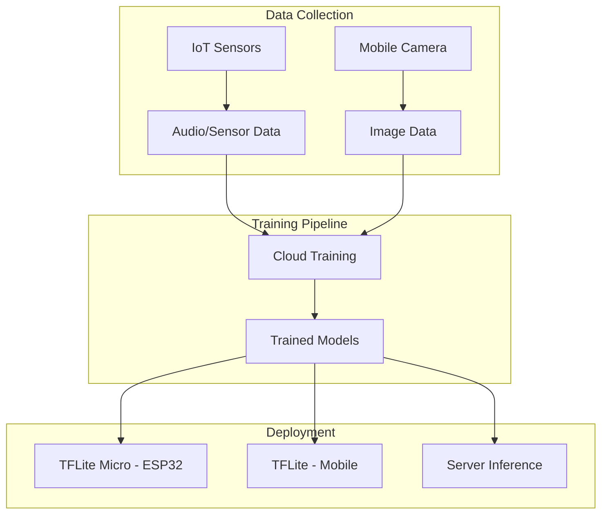

# Machine Learning Implementation Plan

> Separate plan for ML components across firmware (TFLite Micro) and mobile app (TFLite + frontier models)

---

## Overview

| Platform | Runtime | Use Case |
|----------|---------|----------|
| **ESP32 Firmware** | TFLite Micro | Acoustic detection, flow estimation |
| **Mobile App** | TFLite + GPU delegates | Plant health, image classification, sensor fusion |
| **Cloud/Server** | PyTorch/TensorFlow | Model training, fine-tuning |

---

## Current Models (aws-iot-core-poc)

### Existing Models in Firmware

| Model | Type | Purpose | Location |
|-------|------|---------|----------|
| ON/OFF Detection | Binary Classifier | Detect shower running | `components/model/models/` |
| Flow Estimation | Regression | Estimate water flow rate | `components/model/models/` |

**Configuration**: See [model_config.h](file:///home/fabio/Documents/savearth/aws-iot-core-poc/components/model/model_config.h)

---

## ML Architecture



---

## Phase 1: Firmware ML Enhancement

### Goals
- Document existing model architecture
- Create training pipeline for ON/OFF and Flow models
- Implement model versioning

### Tasks

| Task | Description | Priority |
|------|-------------|----------|
| ML-FW-001 | Extract training data format from firmware logs | P0 |
| ML-FW-002 | Create Python training script for ON/OFF model | P0 |
| ML-FW-003 | Create Python training script for Flow model | P0 |
| ML-FW-004 | Model quantization pipeline (FP32 → INT8) | P0 |
| ML-FW-005 | Automated model validation against test set | P1 |

### Deliverables
- `ml/training/on_off_model.py`
- `ml/training/flow_model.py`
- `ml/scripts/quantize.py`
- `ml/datasets/` (audio samples, labels)

---

## Phase 2: Mobile ML Integration

### Goals
- On-device inference for plant health
- Camera + sensor fusion for training data collection
- Support for frontier models (GPU/NPU delegates)

### Tasks

| Task | Description | Priority |
|------|-------------|----------|
| ML-APP-001 | TFLite Flutter integration | P0 |
| ML-APP-002 | Plant health classification model | P1 |
| ML-APP-003 | Camera preprocessing pipeline | P0 |
| ML-APP-004 | Training sample upload API | P0 |
| ML-APP-005 | GPU delegate for faster inference | P1 |

### Mobile ML Stack

```dart
// pubspec.yaml
dependencies:
  tflite_flutter: ^0.10.0
  tflite_flutter_helper: ^0.3.0
  camera: ^0.10.5
  image: ^4.0.0
```

---

## Phase 3: Sensor Fusion

### Concept

Combine data from multiple sources for richer ML training:

| Source | Data | Example |
|--------|------|---------|
| **IoT Device** | Audio, temperature, humidity | Shower sound patterns |
| **Mobile Camera** | Images, video | Plant photos |
| **Mobile Sensors** | GPS, accelerometer, ambient light | Context data |

### Fusion Pipeline

```
[IoT Telemetry] ──┐
                  ├──► [Fusion Layer] ──► [ML Model] ──► [Prediction]
[Mobile Data] ────┘
```

---

## Phase 4: Training Infrastructure

### Cloud Training

| Service | Purpose | Alternative |
|---------|---------|-------------|
| AWS SageMaker | Model training | Self-hosted Jupyter |
| S3 | Dataset storage | MinIO |
| Lambda | Inference API | FastAPI on K8s |

### Self-Hosted Training

For privacy-focused deployments:

```bash
# Docker-based training environment
docker run -v ./data:/data -v ./models:/models \
  tensorflow/tensorflow:latest-gpu \
  python train.py --dataset /data --output /models
```

---

## Model Versioning

```
models/
├── on_off/
│   ├── v1.0.0/
│   │   ├── model.tflite
│   │   ├── metadata.json
│   │   └── test_results.json
│   └── latest -> v1.0.0/
├── flow/
│   └── v1.0.0/
└── plant_health/
    └── v0.1.0/
```

---

## Testing Strategy

| Test Type | Framework | Target |
|-----------|-----------|--------|
| Model Unit Tests | pytest | 100% ops covered |
| Accuracy Tests | Custom | >95% on test set |
| Latency Tests | Benchmark | <100ms (mobile), <50ms (ESP32) |
| Edge Cases | Manual | Corner cases documented |

---

## Roadmap

| Phase | Timeline | Deliverables |
|-------|----------|--------------|
| Phase 1 | Weeks 1-4 | Firmware training pipeline |
| Phase 2 | Weeks 5-8 | Mobile TFLite integration |
| Phase 3 | Weeks 9-12 | Sensor fusion prototype |
| Phase 4 | Weeks 13-16 | Training infrastructure |
